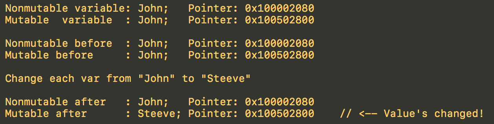

# This repo represents bug in implementation of constructor of an object which has `copy` property

Imagine that you:

- have a property of **non-mutable** class (`NSString`, `NSArray`, `NSDictionary` etc) which has `copy` modifier: `@property (copy, nonatomic) NSString *name;`

- It's possible to assign no it any **mutable** subclass instance (`NSMutableString`, `NSMutableArray`, `NSMutableDictionary` etc)

- You have to pay attention while implementing custom constructors.

See this example:

The property is declared as **`copy`**

**User.m**

```objective-c
@interface User : NSObject

@property (copy, nonatomic) NSString *name;

- (instancetype)initWithName:(NSString *)name;

@end
```

The problem is in the **constructor**

**User.m**

```objective-c

- (instancetype)initWithName:(NSString *)name {
    
    if (self = [super init]) {
    
        // Just assigns. Setter won't be called!
        _name = name;
        
        // Correct:
        // _name = [name copy];
    }
    
    return self;
}
```

## Let's exploit this vulnerability

```objective-c
NSString *stringName = @"John";
NSMutableString *mutableStringName = [NSMutableString stringWithString:@"John"];
    
User *userWithNonmutable = [[User alloc] initWithName:stringName];
User *userWithMutable = [[User alloc] initWithName:mutableStringName];

NSLog(@"Nonmutable variable: %@;   Pointer: %p", stringName, stringName);
NSLog(@"Mutable  variable  : %@;   Pointer: %p", mutableStringName, mutableStringName);

NSLog(@"");
    
NSLog(@"Nonmutable before  : %@;   Pointer: %p", userWithNonmutable.name, userWithNonmutable.name);
NSLog(@"Mutable before     : %@;   Pointer: %p", userWithMutable.name, userWithMutable.name);

NSLog(@"");

NSString *newName = @"Steeve";
NSLog(@"Change each var from \"%@\" to \"%@\"\n", stringName, newName);
    
stringName = newName;
// I don't want "mutableStringName" to change the pointer
[mutableStringName replaceOccurrencesOfString:mutableStringName
                                   withString:newName
                                      options:NSCaseInsensitiveSearch
                                        range:NSMakeRange(0, mutableStringName.length)];

NSLog(@"");

NSLog(@"Nonmutable after   : %@; Pointer: %p", userWithNonmutable.name, userWithNonmutable.name);
NSLog(@"Mutable after      : %@; Pointer: %p    // <-- Value's changed!", userWithMutable.name, userWithMutable.name);
```

## Here is the result



